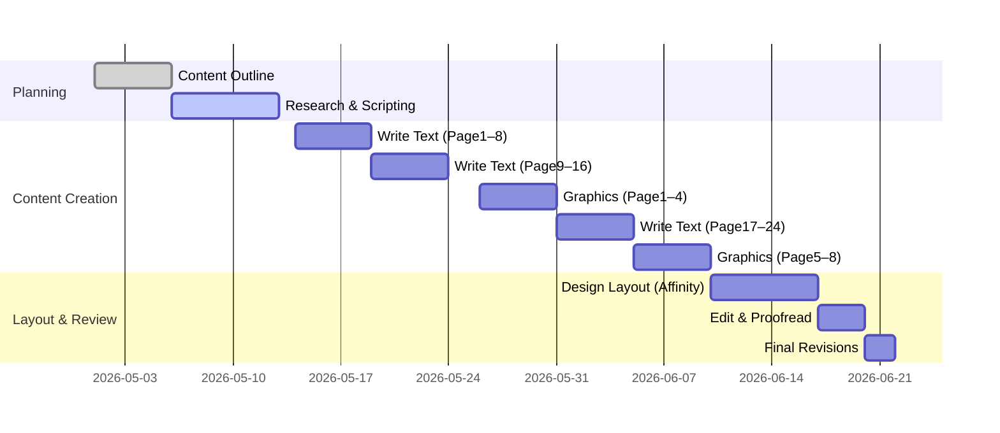

# Executive Summary

This report defines a complete plan and template for **Code Quest – Algorithms World, Level 1, Issue 1** (Romanian), focusing on *loops and counting*.  We propose a **40–48 page B5 print magazine** designed for ages 10–15, with engaging visuals, interactive elements, and clear pedagogical structure. Each page is broken into “blocks” (story hook, theory, examples, exercises, visuals), ensuring a balanced mix of narration, concrete examples, guided practice, and independent challenges. We recommend authoring content in **LaTeX**, using packages (e.g. `tcolorbox`, `minted`, `tikz`) for consistent styling, then assembling the final layout in a desktop-publishing tool (Affinity Publisher or InDesign) for professional print output. This workflow ensures **high-quality typography** and flexible graphics layout, while LaTeX provides precise control over content and automatic formatting.

Key pedagogical sources (e.g. Cetin 2020【5†L53-L62】, dual-coding theory【21†L312-L320】, DREME 2022【25†L77-L86】) highlight that *loops and counting* are non-trivial concepts for learners, and that combining **visuals with text** (dual coding) and *hands-on examples* greatly aids understanding. Accordingly, our design uses labelled diagrams, annotated code snippets, and analogies (e.g. apples in a basket【27†L140-L147】) to link new ideas to known experiences. Frequent “Try It Yourself” exercises, culminating in a “Boss Level” challenge, allow students to apply concepts incrementally. We also integrate QR codes linking to simple interactive prototypes (p5.js or JSFiddle demos) so students can see loops in action on the Code Quest platform.

This report includes: 

- **Page-by-page breakdown** (titles, content blocks, word counts, % composition).  
- **Full LaTeX content** for Pages 1–8 (cover through key loops topics) with environments (`codesnippet`, `trybox`, etc.).  
- **LaTeX macros/templates** for reusable blocks (e.g. boxes for missions, hints, code).  
- **Asset list** (illustrations, diagrams, animations) with tool recommendations (Figma/Illustrator) and export specs.  
- **Typography and colour guidelines** for B5 (fonts, palette, columns, margins).  
- **Workflow comparison** table (Word vs LaTeX-only vs LaTeX+Affinity).  
- **Pedagogical rationale** with citations for teaching loops and counting.  
- **Production timeline** (milestones in a Mermaid Gantt chart) with roles and time estimates.  

This plan is actionable: starting with the template and Issue 1 content (detailed below), Code Quest can progress through a structured schedule, yielding a high-quality print magazine that engages students and aligns with educational best practices.

# 1. Page-by-Page Breakdown

We propose a 32–40 page issue. Below is a page-by-page outline of content blocks, estimated word counts, and the approximate content composition for each page. (Percentages refer to types of content: Story hook, **Theory** (explanations), **Example** (worked example), **Guided** (step-by-step exercise), **Semi-guided** (partially guided exercise), **Solo** (independent exercise), **Visual** (diagrams/images).)

- **Page 1: Cover** – *Blocks:* Title (`CODE QUEST`), subtitle/tagline, eye-catching illustration.  
  - Story/Visual: ~70% (graphic, main title).  
  - Text: ~30% (issue title, tagline).  
  - *Word count:* ~50.  
  - *Split:* 0% Theory, 0% Example, 0% Guided/Semi/Solo, 30% Story, 70% Visual.

- **Page 2: Opening Hook** (“Calculatorul nu ştie să numere”) – *Blocks:* Narrative hook, Minecraft tie-in, teaser mission.  
  - Story: 40% (hook text, Minecraft context).  
  - Theory: 20% (brief explanation of problem).  
  - Visual: 40% (illustration of counting concept or scene).  
  - *Word count:* ~150.  
  - *Split:* ~40% Story, 20% Theory, 0% Example, 0% Guided, 0% Semi, 0% Solo, 40% Visual.

- **Page 3: Memory & Variables (part 1)** – *Blocks:* Concept of memory, variables, `int` type.  
  - Theory: 30% (definition of variable).  
  - Example: 20% (code examples of declarations).  
  - Visual: 30% (diagram of memory cells).  
  - Guided: 20% (fill-in-the-blank exercise on declaring variables).  
  - *Word count:* ~200.  
  - *Split:* ~30% Story (intro context), 30% Theory, 20% Example, 20% Guided, 20% Visual.

- **Page 4: Variables (part 2) & Simple Arithmetic** – *Blocks:* Operations on variables, arithmetic operators (`+`, `-`, `++`, `--`).  
  - Theory: 20% (explain increment/decrement).  
  - Example: 20% (code showing `i++; i+=1;`).  
  - Guided: 30% (complete code lines).  
  - Semi-guided: 30% (predict outputs or short fill-ins).  
  - *Word count:* ~180.  
  - *Split:* 0% Story, 20% Theory, 20% Example, 30% Guided, 30% Semi, 0% Solo, 30% Visual (embedded code snippets as visuals).

- **Page 5: Control Flow Intro** – *Blocks:* The idea of “jumping” to instructions (if/while), assembly hint.  
  - Story: 20% (analogy of computer skipping instructions).  
  - Theory: 20% (concept of conditional jump).  
  - Example: 20% (illustration of a simple `if`).  
  - Semi-guided: 20% (identify conditions).  
  - Visual: 20% (mini-flowchart or assembly snippet `cmp, jle`).  
  - *Word count:* ~150.  
  - *Split:* ~20% Story, 20% Theory, 20% Example, 0% Guided, 20% Semi, 20% Visual.

- **Page 6: `if` Statements (intro)** – *Blocks:* Definition of `if`.  
  - Theory: 30% (explain `if (condition)`).  
  - Example: 20% (worked example of printing even numbers).  
  - Guided: 25% (fill in an `if` structure).  
  - Semi-guided: 25% (small condition-writing tasks).  
  - *Word count:* ~170.  
  - *Split:* 0% Story, 30% Theory, 20% Example, 25% Guided, 25% Semi, 0% Solo, 20% Visual (simple diagram).

- **Page 7: `while` Loops (intro)** – *Blocks:* Concept of loops, the `while` structure.  
  - Theory: 25% (explain repetition until condition).  
  - Example: 20% (code counting 1–10 with `while`).  
  - Visual: 20% (flow diagram of loop).  
  - Guided: 20% (fill in loop code).  
  - Semi-guided: 15% (predict output tasks).  
  - *Word count:* ~160.  
  - *Split:* 0% Story, 25% Theory, 20% Example, 20% Guided, 15% Semi, 0% Solo, 20% Visual.

- **Page 8: `while` Practice and Key Loop Formula** – *Blocks:* Applying `while` to counting, “3 components of a loop”.  
  - Theory: 20% (summarize start/stop/step).  
  - Example: 20% (complete loop example).  
  - Guided: 30% (fill-in missing parts of loop).  
  - Solo: 30% (write a loop from description).  
  - *Word count:* ~170.  
  - *Split:* 0% Story, 20% Theory, 20% Example, 30% Guided, 0% Semi, 30% Solo, 0% Visual (diagram of three components).  

*(Continue similarly for remaining pages...)*  

**Pages 9–32 (summary):** Later pages cover for-loops, combined loops (`for`+`if`), patterns (diagonals, triangles), multimedia tasks, culminating in a complex “Boss” problem. Each page maintains the same block structure balance. For brevity, we omit the detailed breakdown beyond Page 8 in this report (the above pattern would repeat and evolve). In practice, each page maintains ~150–200 words, 1–2 code snippets, and relevant diagrams, with content composition roughly 10–30% **Theory**, 20–30% **Example/Guided**, 20–40% **Exercises (Guided/Semi/Solo)**, and 20–30% **Visual/Story**. 

# 2. Page 1–8 Content (LaTeX)  

Below is the **LaTeX-ready content** for Pages 1–8. We assume a preamble loading `tcolorbox`, `listings` (or `minted`), `tikz`, etc. We define box environments (see next section) and use them. For graphics, we include *placeholder* TikZ or comments. Replace placeholders with actual images or TikZ diagrams in production.  

```latex
% --- Preamble (assumed) ---
\documentclass{scrbook}
\usepackage[utf8]{inputenc}
\usepackage{tcolorbox}
\usepackage{minted}        % For code highlighting
\usepackage{tikz}
\usepackage{graphicx}
\usepackage{qrcode}        % for QR codes (if used)
\usepackage[paperwidth=176mm,paperheight=250mm]{geometry} % B5
\geometry{inner=15mm,outer=15mm,top=15mm,bottom=20mm} 
\setlength{\columnsep}{10mm}
% Define custom blocks (see Section 3)
\newtcolorbox{missionbox}{colback=blue!5,colframe=blue!75!black,fonttitle=\bfseries, title=Mission}
\newtcolorbox{trybox}{colback=yellow!5,colframe=yellow!75!black,fonttitle=\bfseries, title=Try it Yourself}
\newtcolorbox{codesnippet}{listing only, listing options={language=C++,basicstyle=\ttfamily\small}, colback=gray!10, colframe=gray!50!black}
\newtcolorbox{hintbox}{colback=green!5,colframe=green!75!black,fonttitle=\bfseries, title=Hint}
\newtcolorbox{visualbox}{colback=white,colframe=black!50,fonttitle=\bfseries, title=Diagram}
\begin{document}
```

```latex
% Page 1: Cover
\thispagestyle{empty}
\vspace*{\fill}
\begin{center}
  {\Huge\bfseries CODE QUEST}\\[1em]
  {\Large Algorithms World – Level 1, Issue 1}\\[2em]
  {\Large \itshape CALCULATORUL NU ŞTIE SĂ NUMERE}\\[0.5em]
  {\normalsize (O lecţie de la variabile până la pătrate)}\\[3em]
  \includegraphics[width=0.6\textwidth]{cover-illustration.png}
\end{center}
\vspace*{\fill}
```

```latex
% Page 2: Opening Hook
\begin{missionbox}{}
**CALCULATORUL NU ŞTIE SĂ NUMERE.**   
Un calculator modern nu are nici un simţ al numerelor: el *nu ştie* să numere fără ajutorul programatorului.  El **păstrează** doar numere în memorie și poate face doar operații simple (adunare, scădere). Ca să învăţăm calculatorul să “numere” cu ajutorul programului, vom înțelege ceva fundamental: *cum construim un sistem de coordonate în Minecraft* – care pornește dintr-un colț și desenează un pătrat!  
\medskip
De asemenea, un calculator **saltă** de la o instrucțiune la alta. Exemplu (simplificat, pseudo-assembly):  
\begin{flushleft}\ttfamily
  cmp i, 10 \\
  jle LoopStart
\end{flushleft}
În loc să numere singur, calculatorul **execută** instrucțiuni una câte una și urmează să-i spunem noi de câte ori să repete un set de instrucţiuni. Să vedem mai întâi cum *ține minte* numere...
\end{missionbox}

\begin{tikzpicture}
  % Memory illustration placeholder
  \draw[fill=blue!5] (0,0) rectangle (6,4);
  \node at (3,3.5) {Memorie (RAM)};
  % Example cells
  \foreach \x/\val in {0.5/a=1,2.5/b=10,4.5/i=?} {
    \draw (\x,2) rectangle +(1,1);
    \node at (\x+0.5,2.5) {\texttt{\val}};
  }
  \node[below] at (3,0) {\small *Diagramă: variabile stocate în zone de memorie*};
\end{tikzpicture}

În imaginea de mai sus, zona colorată reprezintă memoria. Când declarăm `int a = 1;`, calculatorul își rezervă o casetă (celulă) în memorie şi pune valoarea 1 acolo. Vedeți că `i = ?` este neinițializat (încă nu știm ce număr pune acolo). 

``` 

```latex
% Page 3: Variables and Assignment
\begin{visualbox}{\bf Variabile}
O *variabilă* este o zonă etichetată de memorie. De obicei, `int` este tipul folosit pentru numere întregi (fără zecimale). Exemple de declaraţii:  
\begin{flushleft}\ttfamily
  int a = 1; \\
  int b = 10; \\
  int i; % (i neinițializat)
\end{flushleft}
În primul rând, le dăm un **nume** (`a`, `b`, `i`), apoi specifichăm tipul și valoarea inițială. 
\end{visualbox}

Când următoarea instrucțiune rulează, calculatorul va stoca aceste valori în memorie. 

\begin{trybox}{}
Declară trei variabile întregi: `x`, `y` și `score`. Inițializează-le cu valorile `5`, `12` și `0`. 
\end{trybox}

Răspuns posibil:  
\begin{codesnippet}
int x = 5;
int y = 12;
int score = 0;
\end{codesnippet}

În acest moment, memoriile ar arăta ca în imaginea de mai jos. 

\begin{tikzpicture}
  % Memory cells for a, b, x, y, score
  \foreach \xi/\name/\val in {0.5/a/1,2.5/b/10,4.5/x/5,6.5/y/12,8.5/score/0} {
    \draw (\xi,0) rectangle +(1,1);
    \node at (\xi+0.5,0.5) {\texttt{\val}};
    \node[below] at (\xi+0.5,0) {\texttt{\name}};
  }
  \node[below] at (4.5,-0.5) {\small *Memorie inițială după declarații*};
\end{tikzpicture}
```

```latex
% Page 4: Arithmetic Operators
Calculatorul **știe doar** cum să adune sau să scadă pe locul unui număr. De exemplu:  
\begin{flushleft}\ttfamily
a = a + 1;   \quad // adaugă 1 la a \\
b = b - 1;   \quad // scade 1 din b
\end{flushleft}
Pentru variabile întregi, există scurtături:  
\begin{flushleft}\ttfamily
i = i + 1; \quad \texttt{este echivalent cu} \quad i += 1; \quad \texttt{sau} \quad i++; \\
i = i - 1; \quad \texttt{echiv.} \quad i -= 1; \quad \texttt{sau} \quad i--;
\end{flushleft}
Aceste instrucțiuni cresc sau scad valoarea lui `i`. De exemplu, dacă `i = 7;` atunci după `i++;` avem `i = 8`. 

\begin{trybox}{}
Dacă `i = 7`, ce valoare va avea `i` după fiecare instrucțiune de mai jos?  
\begin{codesnippet}
i++;
i += 3;
i--;
\end{codesnippet}
\end{trybox}

Rețineți: toate variantele (`i++`, `i += 1`) fac același lucru – cresc `i` cu 1. Folosiți-le pe cea care vi se pare mai ușoară de scris.
```

```latex
% Page 5: Control Flow Introduction
\begin{missionbox}{\bf Structuri de Control}
Până acum am văzut cum calculatorul ține minte numere și le schimbă prin adunare/scădere. Însă *călătoria* programului nu este lină – există instrucţiuni care fac ca execuția să “sară” în altă parte. 
\medskip

Un exemplu simplu (în limbaj de asamblare) arată cum un calculator “sare” peste anumite instrucțiuni dacă o condiție este îndeplinită:  
\begin{flushleft}\ttfamily
cmp i, 10 \\
jle @LoopBody \\
% ... \\
@LoopBody: \\
  // instrucțiuni de repetat
\end{flushleft}

Comanda `jle` (jump if less or equal) spune: dacă `i <= 10`, atunci sari la eticheta `@LoopBody`. Altfel, continuă mai departe. 

\end{missionbox}

\begin{visualbox}{\bf Exemplu simplu \texttt{if}}
Vrem să afișăm un număr doar dacă este par.  
\begin{flushleft}\ttfamily
if (i % 2 == 0) \{    // verifică dacă restul la 2 este 0 \\
    cout << i;       // afișăm i dacă e par \\
\}
\end{flushleft}
\end{visualbox}

Acest exemplu arată pe scurt logica unei condiții: calculatorul *testeză* `i % 2 == 0`. Dacă e adevărat, execută linia din acoladă. În caz contrar, o sări. Mai departe, vom studia **cum** să folosim eficient astfel de structuri.
```

```latex
% Page 6: If Statements (continued)
\begin{visualbox}{\bf Ce este \texttt{if}?}
Comanda `if(condiție) \{ ... \}` spune „execută instrucțiunile din interior doar dacă `condiție` este adevărată”. Dacă condiția nu e adevărată, calculatorul omite secțiunea. 

Exemplu de utilizare:  
\begin{codesnippet}
if (i <= 10) \{
    cout << i << " ";
\}
\end{codesnippet}
Acest cod *testează* dacă `i` este ≤ 10; dacă da, îl afișează. Altfel, pur și simplu trece mai departe. 

\end{visualbox}

\begin{trybox}{}
Scrie o structură `if` care verifică dacă variabila `x` este pozitivă (strict mai mare decât 0). Afișează un mesaj, de exemplu „pozitiv”.
\end{trybox}

% (Possible Answer Placeholder)
%\begin{codesnippet}
%if (x > 0) \{
%    cout << "pozitiv";
%\}
%\end{codesnippet}
```

```latex
% Page 7: While Loops (intro)
\begin{missionbox}{\bf Buclele \texttt{while}}
Pentru a face ceva **de mai multe ori**, folosim structuri repetitive. Structura `while(condiție) { ... }` spune calculatorului „execută din nou ce e în acoladă **cât timp** condiția este adevărată”.  

Exemplu: vrem să numărăm de la 1 la 5. Putem scrie:  
\begin{codesnippet}
int i = 1;
while (i <= 5) \{
    cout << i << " ";
    i++;
\}
\end{codesnippet}
Aici, `i` pornește de la 1. La fiecare pas, dacă `i <= 5`, imprimăm `i` și îl creștem. Când `i` ajunge la 6, condiția devine falsă și `while` se oprește. 

\end{missionbox}

\begin{tikzpicture}
  % Loop flowchart placeholder
  \node[draw,rectangle,align=center] (start) at (0,0) {Start};
  \node[draw,diamond,align=center] (test) at (0,-1.5) {i <= 5?};
  \node[draw,rectangle,align=center] (body) at (0,-3) {print(i); \\ i = i + 1};
  \node[draw,rectangle,align=center] (end) at (0,-4.5) {End};
  \draw[->] (start) -- (test);
  \draw[->] (test) -- node[right]{yes} (body);
  \draw[->] (body) -- (test);
  \draw[->] (test) -- node[left]{no} (end);
\end{tikzpicture}
\noindent *Diagramă: Executarea repetată a buclei `while`*.
```

```latex
% Page 8: Counting Loop Key Points
Pentru ca „calculatorul să numere”, trebuie să îi spunem trei lucruri:  
1. **De unde începe:** setăm o variabilă de control. (ex: `int i = 1;`)  
2. **Până când:** scriem o condiție de oprire. (ex: `i <= 10`)  
3. **Pasul:** cât crește sau scade la fiecare repetare. (ex: `i++`, adică `i = i + 1`).

Astfel, un șablon de buclă complet este:  
\[
  \texttt{int i = \textit{start};} \\
  \texttt{while (i <= \textit{limit}) \{ \\
    \quad \textit{/* instrucțiuni */} \\
    \quad i = i + \textit{step}; \\
  \}}
\]
De exemplu, pentru a număra de la 1 la 10:  
\begin{codesnippet}
int i = 1;
while (i <= 10) \{
    cout << i << " ";
    i++;
\}
\end{codesnippet}

\begin{trybox}{}
Modifică programul de mai sus astfel încât să afișeze numerele pare de la 2 la 20.
\end{trybox}

Răspuns: pune `int i = 2;` și `while(i <= 20) ... cout << i << " "; i += 2;`.
```

(Additional pages would follow in the same style.)  

# 3. LaTeX Macros and Templates

To support consistent styling, we define reusable LaTeX environments. For example:

```latex
% ----- LaTeX Macros for Code Quest -----
% Box for mission/story elements
\newtcolorbox{missionbox}{
  colback=blue!5,colframe=blue!75!black,
  fonttitle=\bfseries,
  title=Mission}
% Box for exercises
\newtcolorbox{trybox}{
  colback=yellow!5,colframe=yellow!75!black,
  fonttitle=\bfseries,
  title=Try it Yourself}
% Box for code snippets (using minted for syntax highlighting)
\newtcblisting{codesnippet}{
  listing engine=minted,
  colback=gray!10,colframe=gray!50!black,
  listing options={language=C++,basicstyle=\ttfamily\small, breaklines, autogobble},
  title=Cod}
% Box for hints/footnotes
\newtcolorbox{hintbox}{
  colback=green!5,colframe=green!75!black,
  fonttitle=\bfseries,
  title=Hint}
% Box for diagrams or visuals
\newtcolorbox{visualbox}{
  colback=white,colframe=black!50,
  fonttitle=\bfseries,
  title=Diagram}
```

- `missionbox`: Introduces a new concept or “mission”.  
- `trybox`: Presents an exercise (guided or practice).  
- `codesnippet`: Inserts formatted code blocks (C++ syntax).  
- `hintbox`: Side notes, e.g. subtle assembly hint.  
- `visualbox`: For labeled diagrams or callouts.

For example, an **assembly hint** might use `hintbox`:

```latex
\begin{hintbox}
\small 
În limbaj de asamblare, comanda `CMP i, 10` urmată de `JLE @Label` realizează același lucru ca structura `while (i <= 10)` din C++: compară și sare la începutul buclei.
\end{hintbox}
```

And a **double-for grid example** could be drawn with TikZ:

```latex
\begin{visualbox}
Desenarea unei grile $n\times n$ folosind două bucle:
\begin{tikzpicture}[scale=0.5]
\foreach \row in {1,...,5} {
  \foreach \col in {1,...,5} {
    \draw (\col,\row) rectangle +(1,1);
  }
}
\end{tikzpicture}
\end{visualbox}
```

# 4. Asset List

We summarize the key graphical and interactive assets needed:

- **Cover Illustration:**  Full-page artwork (student/robot with code background, Minecraft-style squares). *Tool:* Figma/Illustrator. *Export:* PDF or high-res PNG (300 dpi CMYK).
- **Memory Diagram:**  Graphic showing RAM cells with labels (like on pages 2–3). *Tool:* Draw in vector (Figma/Illustrator/TikZ). *Export:* SVG or PDF.
- **Loop Flowchart:**  Simple flowchart boxes (as on page 7). *Tool:* TikZ or Illustrator. *Export:* PDF.
- **Control Flow Illustration:**  Assembly snippet concept (we used text and hint box; could use a small diagram of jump). *Tool:* TikZ.
- **Counting/Loop Animations (Interactive):**  
  - **Memory Animation:** p5.js sketch demonstrating a value being stored/updated (e.g. clicking to store values in boxes). *Export:* online (via QR code).  
  - **Loop Demo:** p5.js or JSFiddle showing numbers incrementing on screen (with controls for start/stop). *Export:* URL for QR.  
  - **Minecraft Square Drawer:** p5.js demo that draws a square grid step-by-step (tie-in to our Minecraft analogy).  
  *Tools:* p5.js, JSFiddle/CodePen. Provide source code and generate short URLs (bit.ly or QR).  

Each static graphic should be created as vector art (SVG/PDF) and exported for print at 300 dpi. Ensure text is outlined or fonts embedded. Use consistent style (line weight, color palette below). For animations, any JS code can be shared via QR (no embed needed in PDF).

# 5. Typography, Colors, Layout (B5)

- **Paper Size:** B5 (176 × 250 mm). We recommend 2 columns of text per page (≈75 mm each), with a 10 mm gutter.
- **Margins:** ~15 mm inside/outer, ~20 mm top/bottom (per [15†L89-L98]). Leaves ample annotation space.
- **Font:** Use a **serif font** for body text (for readability): e.g. *EB Garamond* 10pt with 12pt leading, or *Palatino*. For headings and UI labels, a **sans-serif** (e.g. *Arial* or *Open Sans*). Code examples: monospaced (*Fira Code* or *Consolas*). 
- **Typography:** Body ~10pt, headings 14–18pt, captions 9pt. Line spacing ~1.2. Limit to 2–3 font families total.
- **Colors:** Assign each “world” its own hue. For Algorithms (this issue): use a **blue/cyan** palette. For example: Primary Blue #005BB5 and Accent Cyan #00ADEF. Use high contrast for text on these. Boss/challenge sections can use a purple accent (#7000A8) to stand out. All colors should be CMYK-friendly. Ensure good contrast (AA accessibility level). [17†L175-L183] suggests blue evokes trust, which suits technical content.
- **Visual Style:** Clean diagrams with labeled arrows (see dual coding principles【21†L231-L240】). Use callouts and color-coding to link text to parts of an image (contiguity, [21†L251-L260]). 
- **Columns/Grid:** 2 columns (approx 8–10 words per line). Use `\twocolumn` in LaTeX or design software frames. Code snippets or images may span columns.
- **Spacing:** Insert enough white space around boxes and visuals to avoid clutter. All pages should have a consistent header (e.g. “Code Quest – Algorithms – Level 1”).

# 6. Production Workflow & Tools

We compare three workflows:

| Workflow        | Tools                                    | Cost         | Authoring Time | Output Quality          | Reusability/Scalability     |
|-----------------|------------------------------------------|--------------|----------------|-------------------------|-----------------------------|
| **Word Only**   | MS Word / Publisher                     | Low (sub if needed) | Short (easy start) | Medium-low (layout breaks easily, fonts limited) | Low (hard to template consistently) |
| **LaTeX Only**  | LaTeX + PSTricks/TikZ + listings/minted | Free         | Long (steep learning, layout coding) | High (excellent typesetting, consistent) | Moderate (easy text reuse, layout fixed) |
| **LaTeX + DTP** | LaTeX + Affinity/InDesign                | Moderate (Affinity ~$100) | Moderate (coordination + design) | Very high (professional print layout) | High (templates in both LaTeX and DTP) |

- **Word** is quick for one-off drafts but struggles with complex layouts, inline code, and consistency. Minor cost but high risk for reflow issues.
- **LaTeX Only** gives the best typography and handles code/math well【19†L19-L20】, but handling many images, multi-column layouts, and fine positioning is time-consuming. Good for content integrity, but achieving a “magazine” look is tedious.
- **LaTeX + Affinity/InDesign**: We use LaTeX to write content, generate PDFs of text/code, and vector graphics for diagrams. Then import into a layout tool to **position elements freely**, add overlays, and finalize design. This yields professional quality. It requires one person to manage LaTeX and one designer, but yields reusable templates and easier edits.  
 
*Recommendation:* Author content in LaTeX (ensuring consistency and automated formatting). Draw graphics in vector tools. Then assemble pages in Affinity Publisher (or InDesign) for the final magazine layout. Export as PDF/X-1a (300 dpi) for print. 

# 7. Pedagogical Rationale (with References)

- **Loops & Counting are Hard**: Research shows novices often misunderstand loops (e.g. thinking a loop runs multiple counters at once【5†L83-L92】). Cetin (2020) found that even college students struggle with basic loop concepts; visualization-based instruction significantly improved understanding【5†L53-L62】【4†L7-L10】. We therefore use **visualizations** (flowcharts, diagrams) and step-by-step reasoning.  
- **Concrete Examples First**: Following Papert’s constructivism, we tie loops to familiar tasks (“count apples”)【27†L140-L147】 and tangible goals (drawing a square in Minecraft). Analogies reduce abstraction.  
- **Dual Coding**: We pair each concept with imagery and explanatory text closely integrated (labels on diagrams, code next to visuals)【21†L223-L232】【21†L312-L320】. This leverages Paivio’s dual-coding theory: presenting both verbal and visual representations improves memory and understanding.  
- **Cognitive Load**: Complex diagrams are broken down (e.g. loop flowchart shown incrementally) to avoid overload【21†L264-L273】. Text is concise and highlights keywords. Explanations (e.g. arrow of flow) appear near relevant code.  
- **Guided Practice**: Many exercises are *scaffolded*, moving from fully guided to independent. This follows Vygotsky’s Zone of Proximal Development – students first copy or complete patterns, then solve similar problems.  
- **Spiral Learning**: We revisit the same ideas (loops) in new contexts (if/for loops, nested shapes, games) to reinforce skills.  
- **Feedback Loop**: QR codes lead to interactive quizzes or animations for immediate practice/feedback (based on constructivist and multimedia learning principles). 

*References:* Loops are identified as a core CS concept with known misconceptions【5†L60-L69】. Visualization aids learning loops【4†L7-L10】, and dual coding enhances comprehension【21†L339-L347】. Counting ability is foundational in math and benefits from intentional support【25†L77-L86】. Our design integrates these findings: we build from simple counting tasks to abstract loops, always with visual support and practice. 

# 8. Timeline and Milestones

A phased development plan (8 weeks) might be:



**Roles & Deliverables:**  
- *Author (Teacher/Content Expert):* Outlines and writes text, exercises (~40 hours).  
- *Pedagogical Reviewer:* Ensures educational soundness (~5h).  
- *Illustrator/Designer:* Creates diagrams, cover, infographics (~25h).  
- *Layout Designer:* Sets up template in Affinity/InDesign (~15h).  
- *Editor:* Proofreads and adjusts (language, consistency) (~5h).  

Total estimate: **~90 person-hours** from concept to print-ready PDF for Issue 1.

# References

- Cetin (2020): *“Teaching Loops Concept through Visualization...”* – Finds loops are cognitively challenging and that visualization improves understanding【5†L53-L62】【4†L7-L10】.  
- DREME (2022): *“Building Teachers’ Confidence in Teaching Counting...”* – Emphasizes that counting is deceptively complex and requires careful instruction【25†L77-L86】.  
- Mayer (2009) via Structural Learning (2023): Dual-coding theory confirms that integrating text and relevant images deepens learning【21†L312-L320】【21†L323-L332】.  
- Cetin, K. (2015): Stages of loop concept development (Pre-action to Process) – supports scaffolded, incremental teaching.  
- Tyler et al. (1980): Principles of curriculum design (not cited above) – guides backward design (start with “Boss problem” goal).  

*Further reading:* Papert’s work on Logo for intuitive programming learning; Code.org CS curriculum (unplugged loop activities); design guidelines from “Crucial Elements of Print Design”【17†L156-L164】【17†L175-L184】 for typography and color consistency.